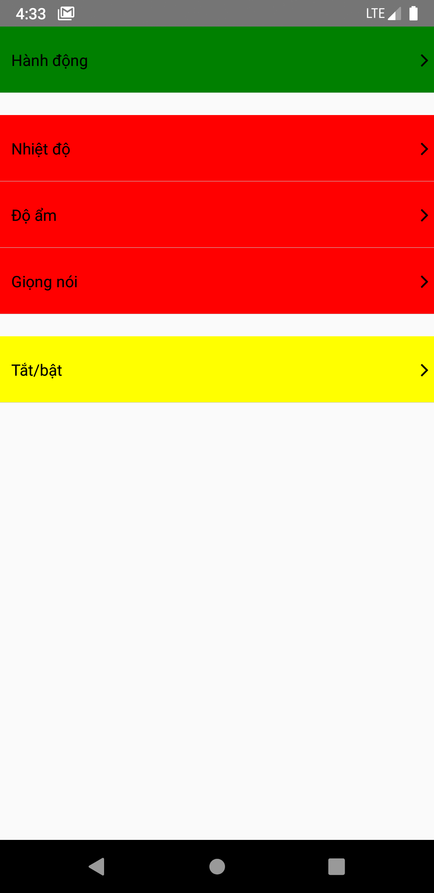

dependences

- react-native-vector-icons
- react-native-color-picker

Cách sử dụng

### Icon

1.  Thuộc tính
    - size : kích thước của icon
    - color : màu của icon
    - name : tên của icon
    - type : thể loại của icon, ví dụ fontawesome, ionicons,...
      Bạn có thể tra cứu trên : https://oblador.github.io/react-native-vector-icons/
2.  Bạn có thể thêm icon
    Ví dụ:
    mở file '../.../component/Icon'
    Ví dụ bạn muốn thêm type AntDesign

```javascript
import React from 'react';
....

//add type
+import {AntDesign} from 'react-native-vector-icons/AntDesign';

export default () => (
    export default (props ) => {
  const {type, size, name, color} = props;

  if (type) {
    const typeCheck = type.toLowerCase();
    const sizeIcon = Number(size);
    switch (typeCheck) {
      case 'feather':
          ....

          // add icon
      +case 'antdesign':{
          return <AntDesign size={size} color={color} name={name}>
      }
    }

);

```

2.  Ví dụ:

```javascript
import {Icon} from './moduleDemoActionsGratIot';

export default () => (
  <Icon size={400} color={color} name={'ios-heart-dislike'} type={'Ionicons'} />
);
```

### IconButton

1. Thuộc tính

   - size : kích thước của icon
   - color : màu của icon
   - name : tên của icon
   - type : thể loại của icon, ví dụ fontawesome, ionicons,...
     Bạn có thể tra cứu trên : https://oblador.github.io/react-native-vector-icons/
   - onPress
   - onPressIn
   - onPresOut
   - disable : mặc định là false, nếu đặt thành true thì sẽ trả về Icon không có thuộc tính Touchable

2. Ví dụ:

```javascript
import {IconButton} from './moduleDemoActionsGratIot';

export default () => {
  const onPress = () => {
    alert('You have been pressed me!');
  };
  return (
    <IconButton
      size={400}
      color={color}
      name={'ios-heart-dislike'}
      type={'Ionicons'}
      onPress={onPress}
      onPressIn={onPressIn}
      onPressOut={onPressOut}
      disable={true}
    />
  );
};
```

### Button

1. Thuộc tính

- name
- value
- style
- iconLeftStyle
- iconRightsTyle
- onPress
- onPressIn
- onPressOut

2. Ví dụ

```javascript
import {Button} from './moduleDemoActionsGratIot';

export default () => {
  return (
    <ScrollView>
      <Button
        name={'Button'}
        value={'Button'}
        style={{
          marginBottom: 30,
          backgroundColor: 'red',
          height: 60,
          borderRadius: 20,
          width: 350,
          alignSelf: 'center',
        }}
        iconLeftStyle={{
          size: 30,
          color: 'rgb(0, 145, 187)',
          type: 'FontAwesome',
          name: 'power-off',
        }}
        iconRightStyle={{
          size: 30,
          color: 'rgb(0, 145, 187)',
          type: 'FontAwesome',
          name: 'angle-right',
        }}
      />
    </ScrollView>
  );
};
```

### ActionButton

1.  Thuộc tính

2.  Ví dụ

```javascript
import {ActionButton} from './moduleDemoActionsGratIot';

const listActions = [
  {
    action: 'POWER',
    command: 'power',
    control: 1,
    listen: 1,
    name: 'Tắt/bật',
    value_type: 'default',
    values: [
      {control: 1, listen: 1, name: 'Bật', value: 'ON'},
      {value: 'OFF', name: 'Tắt', control: 1, listen: 1},
      {value: 'SWITCH', name: 'Đảo ngược', control: 1, listen: 0},
    ],
  },
  {
    action: 'color',
    command: 'COLOR',
    control: 0,
    listen: 1,
    name: 'Màu',
    value_type: 'input',
  },
  {
    action: 'temperature',
    command: 'temperature',
    control: 0,
    listen: 1,
    name: 'Nhiệt độ',
    value_type: 'input',
  },
  {
    action: 'humidity',
    command: 'humidity',
    control: 0,
    listen: 1,
    name: 'Độ ẩm',
    value_type: 'input',
  },

  {
    action: 'GOOGLE_VOICE',
    command: 'google_voice',
    control: 1,
    listen: 0,
    name: 'Giọng nói',
    value_type: 'input',
  },
];

const actionDevice2 = [
  {
    action: 'GOOGLE_VOICE',
    command: 'google_voice',
  },
  {
    action: 'humidity',
    command: 'humidity',
  },
  {
    action: 'temperature',
    command: 'temperature',
  },
];

const actionDevice1 = [
  {
    action: 'POWER',
    command: 'power',
  },
];

export default () => {
  return (
    <>
      {/* many action */}
      <ActionButton
        actions={actionDevice1}
        listActions={listActions}
        style={{marginBottom: 20, backgroundColor: 'green'}}
      />

      {/* see detail for many action */}

      <ActionButton
        isShowDetail={true}
        actions={actionDevice1}
        listActions={listActions}
        style={{backgroundColor: 'red'}}
        onPress={value => alert(value)}
      />

      {/* one action */}
      <ActionButton
        actions={actionDevice2}
        listActions={listActions}
        style={{marginTop: 20, backgroundColor: 'yellow'}}
      />
    </>
  );
};
```


### ValueButton

1.  Thuộc tính
  - command: String,
  - action: String,
  - value_type: String,
  - onPress: Function,
  - onPressIn: Function,
  - onPressOut: Function,
  - isShowDetail: Boolean,
  - style: Object,
  - values: Array /** [{name:value1, controll:value2, listen:value3, value:value4}]*/,
  - valueDefault: String,
2.  Ví dụ

```javascript
import {ActionButton} from './moduleDemoActionsGratIot';

const valuePower = {
    action: 'POWER',
    command: 'power',
    control: 1,
    listen: 1,
    name: 'Tắt/bật',
    value_type: 'default',
    values: [
      {control: 1, listen: 1, name: 'Bật', value: 'ON'},
      {value: 'OFF', name: 'Tắt', control: 1, listen: 1},
      {value: 'SWITCH', name: 'Đảo ngược', control: 1, listen: 0},
    ],
  },

const valueColor = {
    action: 'color',
    command: 'COLOR',
    control: 0,
    listen: 1,
    name: 'Màu',
    value_type: 'input',
  },

export default () => {
  return (
    <>
      <ValueButton
        command={valuePower.command}
        values={valuePower.values}
        value_type={valuePower.value_type}
      />
       <ValueButton
        command={valueColor.command}
        value_type={valueColor.value_type}
      />
    </>
  );
};
```


3. Hướng đẫn thêm mới một kiểu value
   Hiện tại thành phần hỗ trợ hai kiểu value là default và input
   Trong kiểu default thì sẽ có kiểu dành cho power và trong kiểu input thì có hỗ trợ kiểu Color
   Để thêm kiểu khác thì có thể làm theo hướng dẫn sau
   mở file '../.../component/ValueButton'


   Nếu bạn muốn thêm một kiểu value là checkbox

```javascript
    ...
    ...
    const typeCheck = value_type.toLowerCase();
    switch (typeCheck) {
      case 'default':
        if (command) {
          const commandCheck = command.toLowerCase();
          switch (commandCheck) {
            case 'power':
             ....

      case 'input':
       ....

       // add type value

       case 'checkbox':

        //Làm một vài cái gì đó ở đây, có thể trả về một component hay phân loại cấp 2

      default:
        return <></>;
    }
  } else {
    return <></>;
  }
};
```
### Screen
 Cái này đọc code mới biết dùng như thế nào!!!
     
